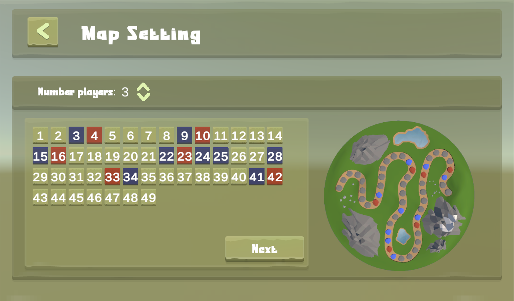
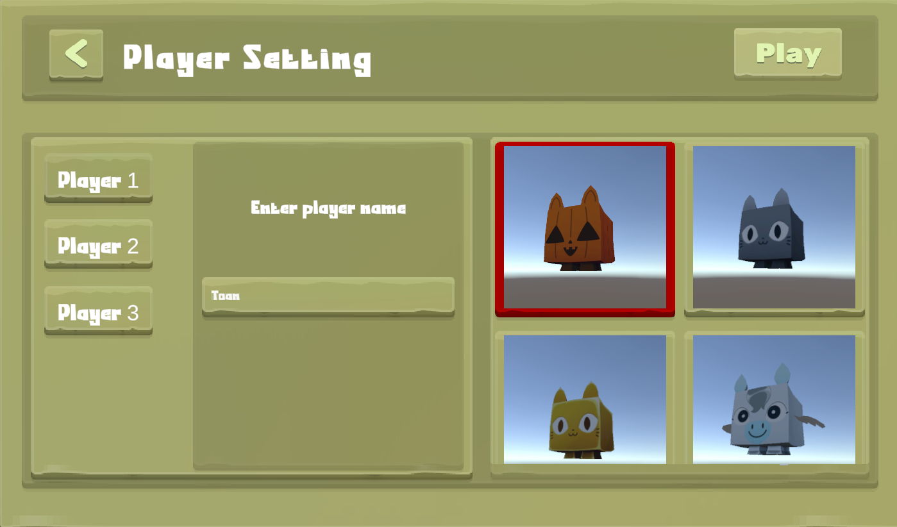
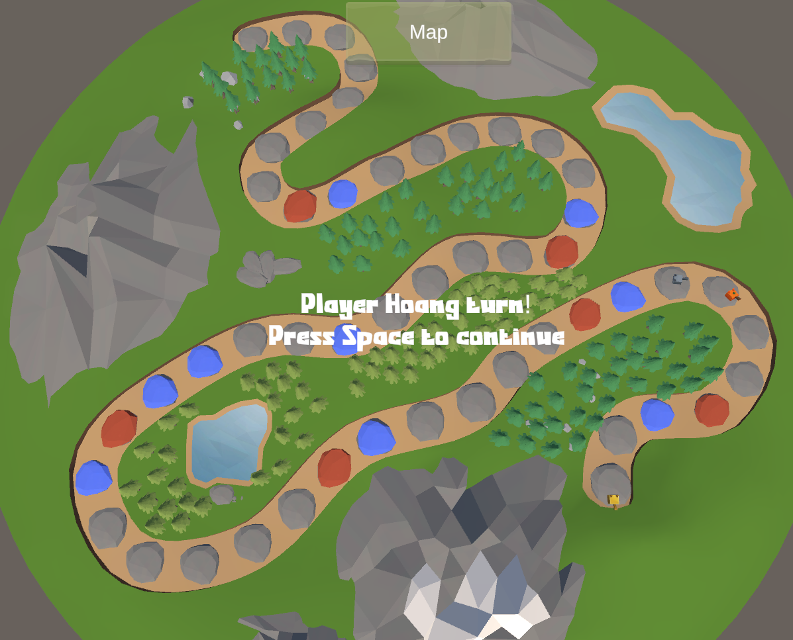
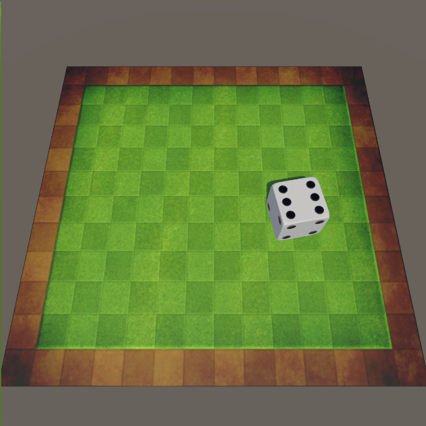
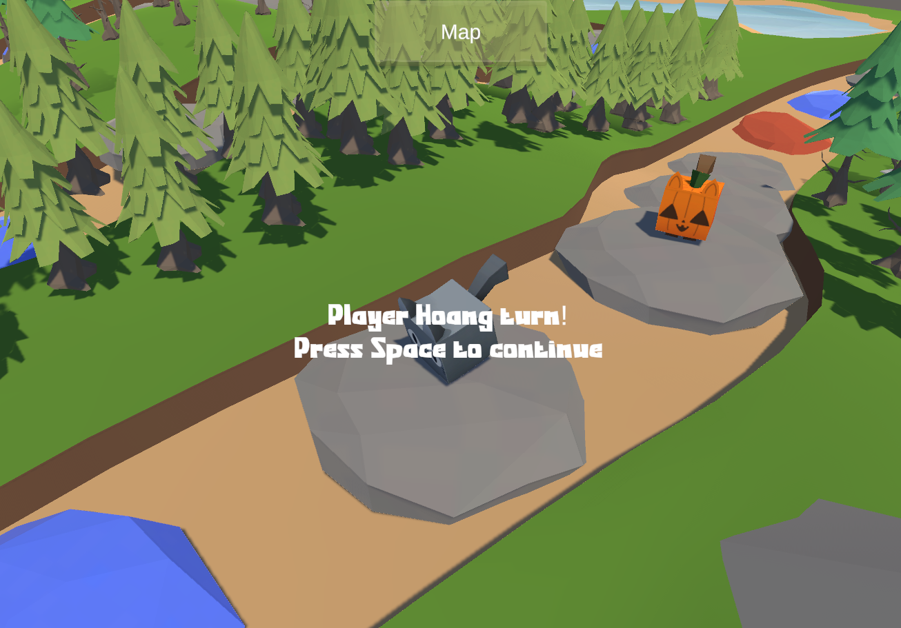

# Unity3D Tablet Game

- Description: A simple tablet quite similar to classic "Snakes and Ladders" game, where player can choose number of characters to join in, start the game, roll the dice, and win the journey.

## Development's Notification

- The game require default dependencies to run, it also need the package name "Spline" (using latest Unity Editor will automatically install the packages, if it's not installed, you can install it manually in package manager).
- The warning encounter when running in editor is relate to new game font installed (doesn't affect to the game), typically, the font doesn't fully support for all key characters so it will use some default font as a replacement. Install a full support font would make it go away.
- Prev exception was the exception related to github lfs missing file problem. Make sure you have git (with lfs) installed in your system in order to clone this project fully.
- Download pre-built game here: https://drive.google.com/file/d/1UFjQxW9nLiferJ4bEcHRslS0uMFVjn4f/view?usp=sharing

## Game Guide

- Map setting: You can change whatever tile you decide to buff or fail by pressing buttons that mark number on the screen. Decide number of players for round with up/down button.
    - (you even able to set number of tiles in a map, but since it is impossible the number of tile in spline when it conflict between internal classes, you have to set it manually in the editor, simply set the number count instantiate in Spline Instantiate Script (attached in Landscape->Spline object in HostScene), and set Number_Of_Sectors attribute same with number count you set in Map Initialize Script along with it)
- Player setting: Name your player when click on player tab and choosing unique model figure that player want to represent.

## Ingame guide:

- Roll the dice: simply press mouse down, drag it and release it to throw the dice.
- Camera focus: picking the player to spot or watch the global map, rotate around player when focus.

## Game features:

- Same-Screen Multiplayer: Decide number of players to play.
- Flexible UI, Unique model figure showcase.
- 3D Simulate dice roll.
- Scoreboard statistic shows when player finish the game, or scoreboards's history show in menu.
- Music, background transistion.
- Game save data system
- camera navigation.

## Game rule
- All the player need to finish their journey in order to complete the game.
- The dice roll when it tilt too much doesn't count, so it will be rolled again.
- When step on the buff tile, gain one more turn, this bonus turn will not addup to the player turn counts.
- When step on the fail tile, player fall back 3 tile, and continue to fall if they keep stepping on the same, fall on the buff tile will not activate it.
- In order the reach to end, player have to roll the dice with exact value of step they going to jump.
## Game Preview

## Future planning
- Adding more challenges, which play significant impact and improce the game experiences
- Adding number of tiles set in map setting.
- More funky sound and character figures behavior.
- More map and model resources.
- Support co-op.
